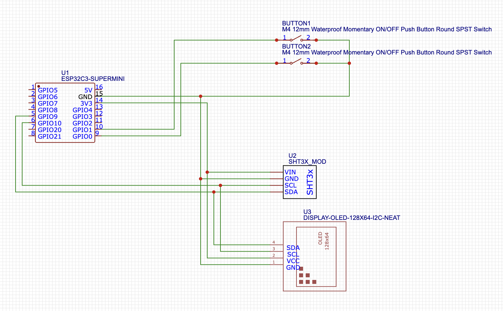

# A small project to create from scratch a desk clock with a 3d printed enclosure

---

## Hardware

### Components

- 1 [ESP32-C3 SuperMini](https://it.aliexpress.com/item/1005007539612437.html)
- 1 [0.96in OLED Display I2C](https://it.aliexpress.com/item/1005008233113190.html)
- 1 [SHT31 Temperature and Humidity Sensor](https://it.aliexpress.com/item/1005007197656840.html)
- 2 [Buttons](https://it.aliexpress.com/item/1005006954454802.html)

### Wiring

### 3D Enclosure

[Box](3D/desk-clock_Box.stl)

[Face](3D/desk-clock_Face.stl)

---

## Software

The code is pretty straight forward, import the modules and display the values, the particularity is that I used the interrupts to handle the button presses
